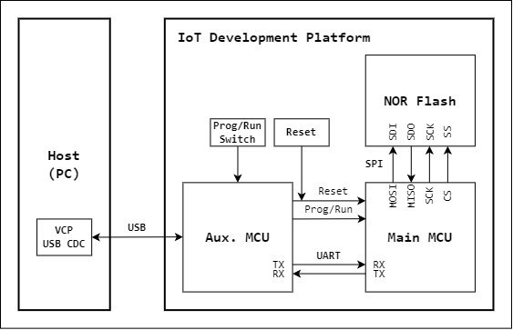

# SerProg

A serial and secure programming tool for microcontroller.

## Reference project

- [SAME54BOOT](https://github.com/cy023/SAME54BOOT)

    Bootloader for Microchip SAME54 series MCU (ARM Cortex-M4F)

- [NuM487BOOT](https://github.com/cy023/NuM487BOOT)

    Bootloader for Nuvoton M480 series MCU (ARM Cortex-M4F)

- [AuxMCUboot](https://github.com/cy023/AuxMCUboot)

    Bootloader for auxiliary MCU (ATmega16U4). The main function is to convert USB-UART protocol.

## Boot scheme

## Bootloader Protocol

### Communication handshake

### Communication command

### Flowchart

### Bootloader packet format

### Bootloader data format

## Secure Boot
