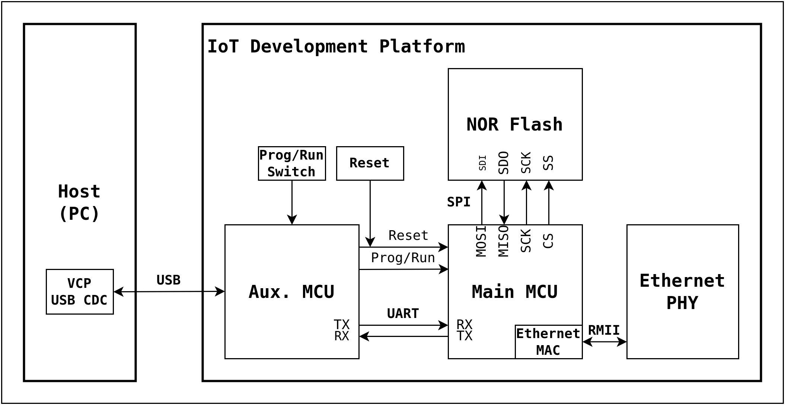
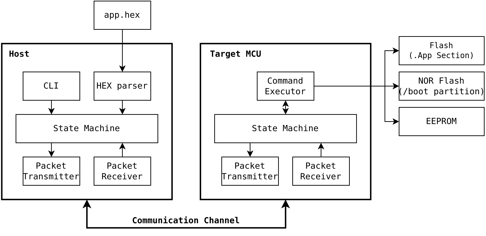
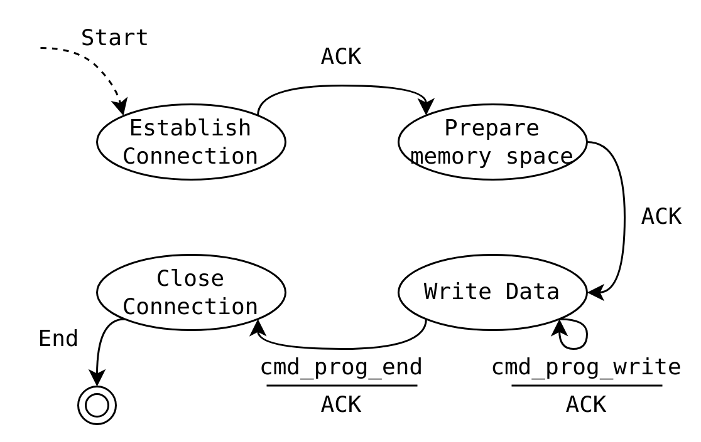
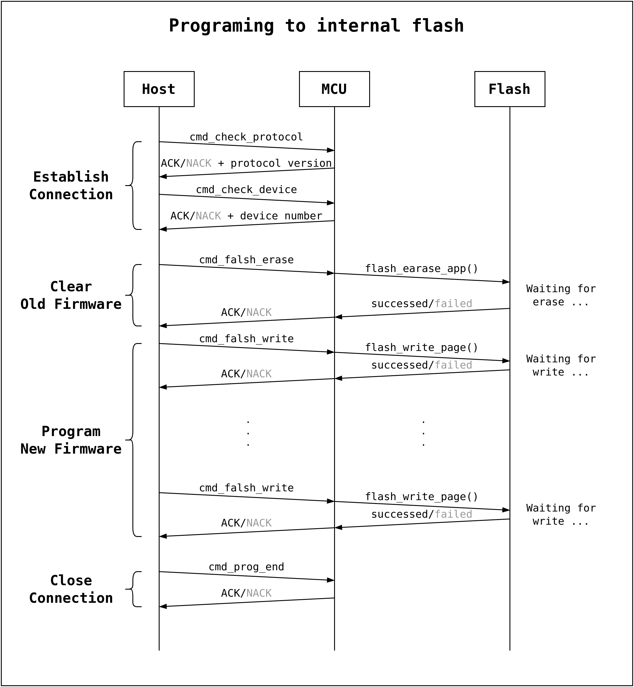
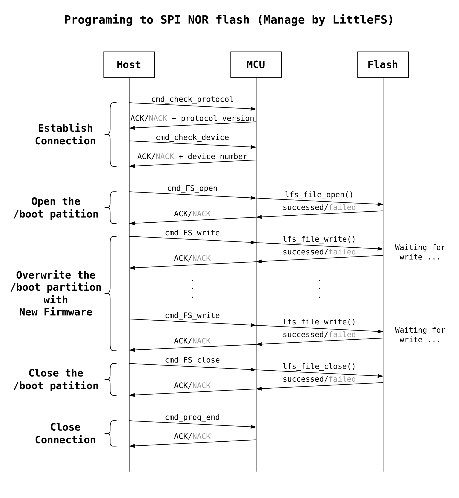
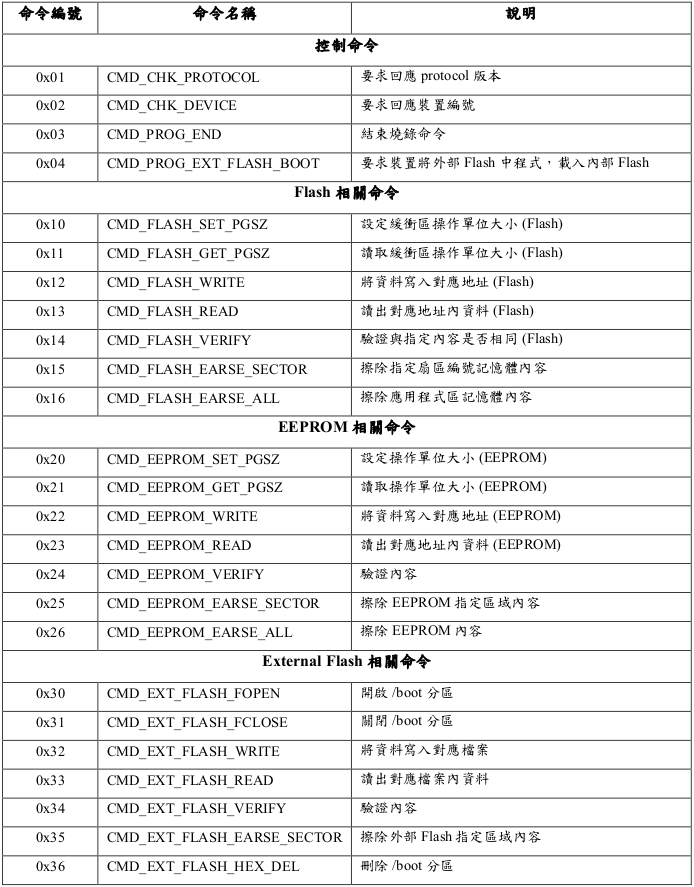
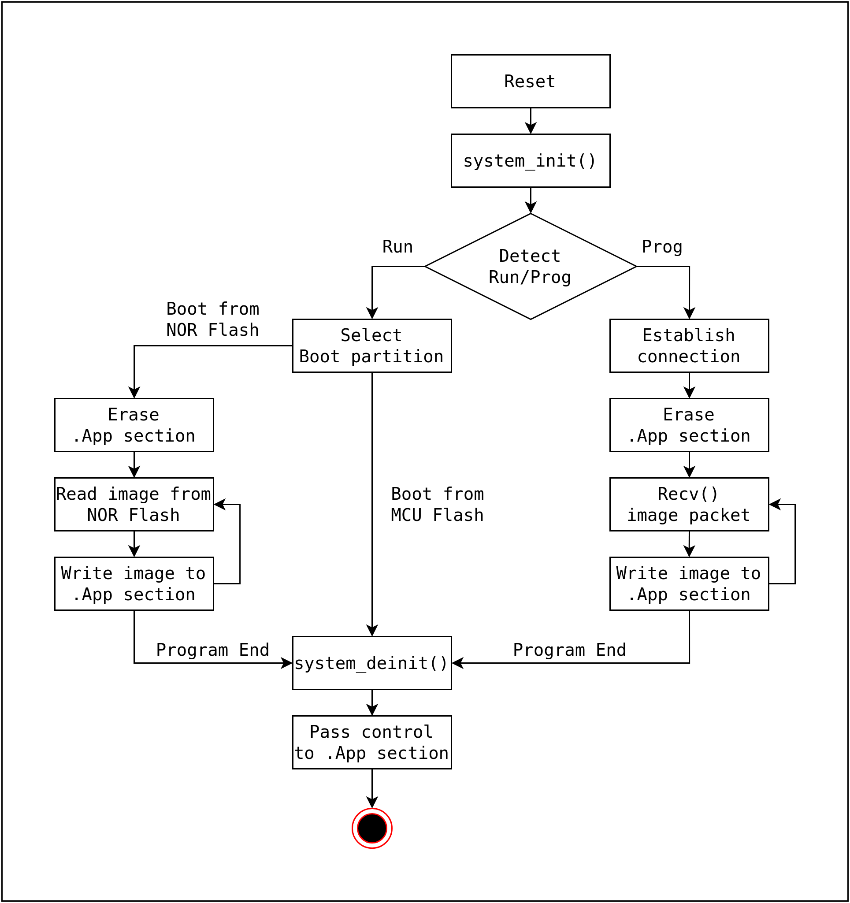

# SerProg

A serial programming tool for microcontroller.

## Reference project

- [SAME54BOOT](https://github.com/cy023/SAME54BOOT)

    Bootloader for Microchip SAME54 series MCU (ARM Cortex-M4F)

- [NuM487BOOT](https://github.com/cy023/NuM487BOOT)

    Bootloader for Nuvoton M480 series MCU (ARM Cortex-M4F)

- [AuxMCUboot](https://github.com/cy023/AuxMCUboot)

    Bootloader for auxiliary MCU (ATmega16U4). The main function is to convert USB-UART protocol.

## Download

You can install this package from PyPI using pip. Simply run the following command:

```bash
pip install serprog
```

## Usage

```bash
usage: serprog prog [-h] [-d DEVICE] -p PORT [-f FLASH_FILE] [-ef EXT_FLASH_FILE] [-e EEPROM_FILE] [-flashboot]

options:
  -h, --help            show this help message and exit
  -d DEVICE, --decice DEVICE
                        The name or number of the device type to be programmed. Can see available device type by
                        subcommand print-device-list.
  -p PORT, --port PORT  The serial port which program burn the device.
  -f FLASH_FILE, --flash FLASH_FILE
                        Set binary file which program to flash.
  -ef EXT_FLASH_FILE, --extflash EXT_FLASH_FILE
                        Set binary file which program to externel flash.
  -e EEPROM_FILE, --eeprom EEPROM_FILE
                        Set binary file which program to eeprom.
  -flashboot, --extflash_boot
                        Program from externel flash to internel flash.
```

- [Example]: program the specified image file (.hex) into the MCU's internal flash.
    ```bash
    serprog prog -p COM1 -f image.hex
    ```
- [Example]: program the specified image file (.hex) into the development board's NOR flash.
    ```bash
    serprog prog -p COM1 -ef image.hex
    ```

## Overview

### Boot scheme
- Hardware scheme
    <div align=center></div>
- Software scheme
    <div align=center></div>

### Bootloader Protocol
#### Finite State Machine
<div align=center></div>

#### Communication handshake
- Programming to internal flash
    <div align=center></div>
- Programming to SPI NOR flash (Managed by LittleFS)
    <div align=center></div>

#### Communication commands
<div align=center></div>

#### Flowchart
<div align=center></div>

<!-- #### Bootloader packet format

#### Bootloader data format -->

<!-- #### Secure Boot -->
